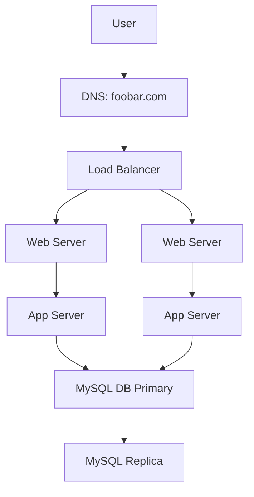

## 3-scale_up

### Overview
Enhances system with component separation and load-balancer clustering.

### Additions
- **1 additional server** for component separation
- **HAProxy cluster** (2 LBs in active-passive)
- **Split responsibilities**:
  - Web server (Nginx)
  - App server (Gunicorn)
  - DB server (MySQL)

### Benefits
- Fault tolerance
- Easier to scale horizontally
- Clean separation of roles

### Flow
User → LB Cluster → Web → App → DB → Response

---

## Diagram (Mermaid syntax)
